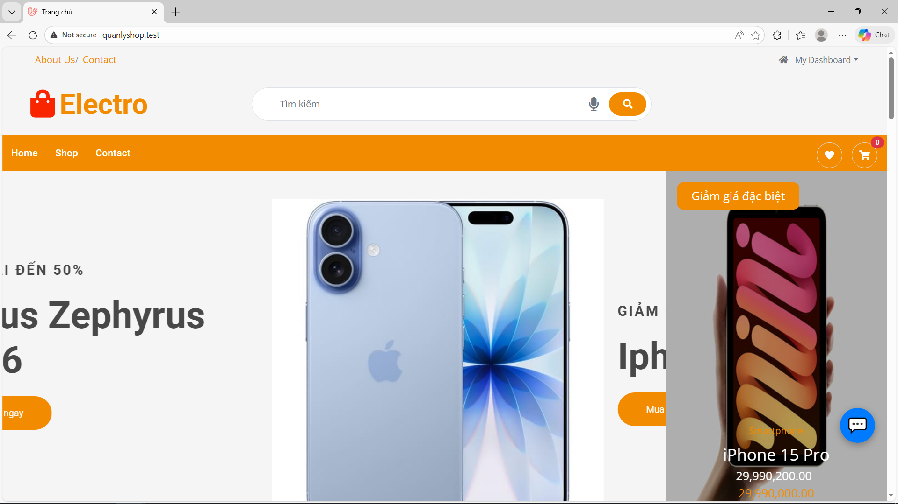
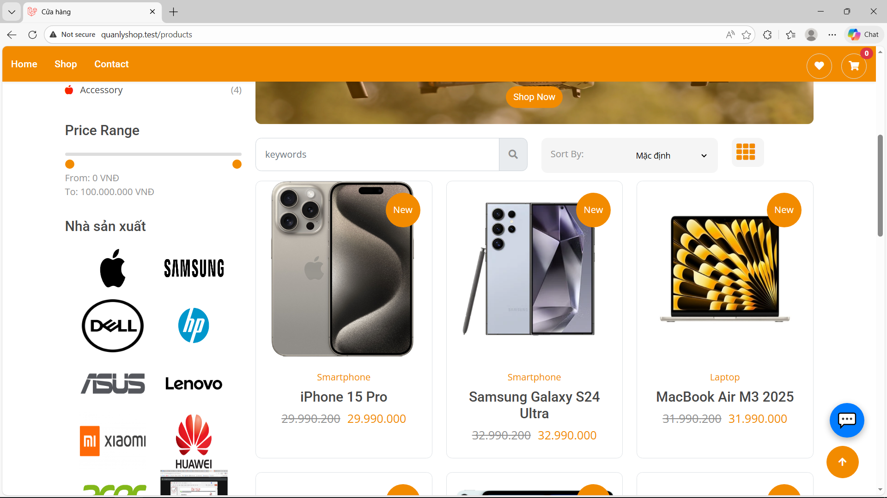
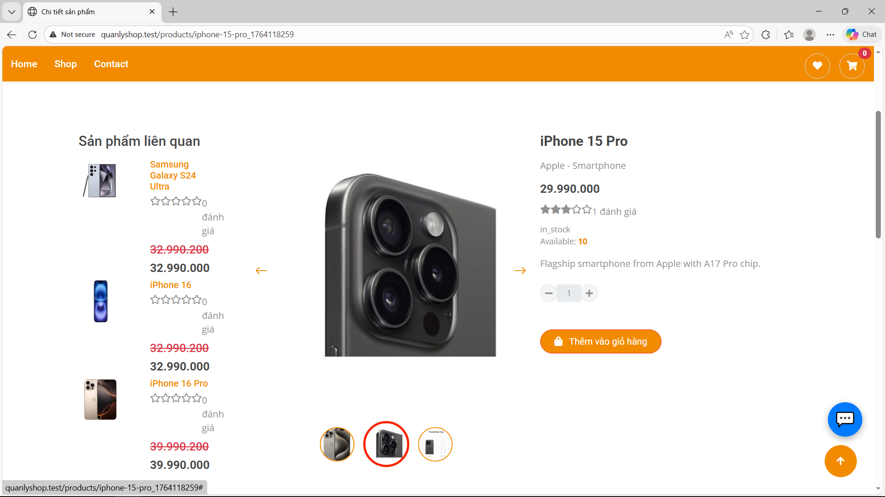
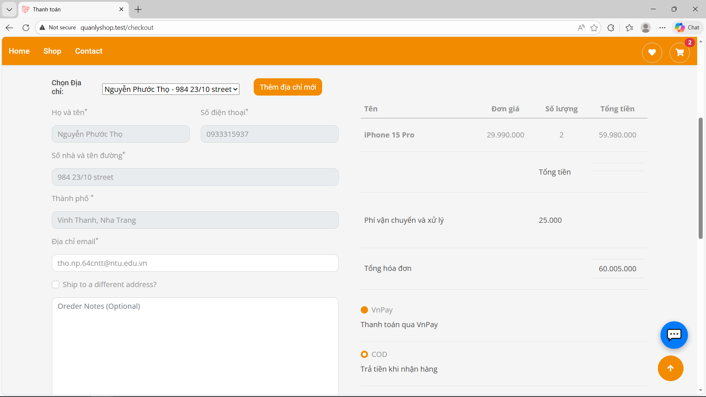

# 🛒 Laravel E-commerce Shop

Hệ thống quản lý cửa hàng trực tuyến được xây dựng bằng Laravel framework, cung cấp đầy đủ tính năng cho một website thương mại điện tử hiện đại.

## 🖼️ Hình ảnh
<div style="padding: 10px;">
  
    
  
  

</div>

## ✨ Tính năng

### Phía Người dùng (Frontend)
- 🏠 **Trang chủ**: Hiển thị sản phẩm nổi bật, khuyến mãi
- 📱 **Danh mục sản phẩm**: Lọc, tìm kiếm, sắp xếp sản phẩm
- 🔍 **Chi tiết sản phẩm**: Hình ảnh, mô tả, đánh giá, sản phẩm liên quan
- 🛒 **Giỏ hàng**: Thêm, xóa, cập nhật số lượng sản phẩm
- 💳 **Thanh toán**: Nhiều phương thức thanh toán (COD, Banking, VNPay, Momo)
- 👤 **Tài khoản**: Đăng ký, đăng nhập, quên mật khẩu
- 📦 **Đơn hàng**: Theo dõi lịch sử và trạng thái đơn hàng
- ⭐ **Đánh giá**: Đánh giá và nhận xét sản phẩm
- 💌 **Wishlist**: Danh sách yêu thích

### Phía Quản trị (Admin)
- 📊 **Dashboard**: Thống kê doanh thu, đơn hàng, sản phẩm
- 📦 **Quản lý sản phẩm**: CRUD sản phẩm, danh mục, thuộc tính
- 🏷️ **Quản lý danh mục**: Tạo và quản lý danh mục sản phẩm
- 📋 **Quản lý đơn hàng**: Xem, cập nhật trạng thái đơn hàng
- 👥 **Quản lý khách hàng**: Thông tin khách hàng, lịch sử mua hàng
- 📧 **Email marketing**: Gửi email quảng cáo, thông báo
- 💰 **Báo cáo**: Doanh thu, sản phẩm bán chạy, khách hàng
- 👨‍💼 **Quản lý admin**: Phân quyền người quản trị
- 📧**Xử lý email của khách hàng**: Xử lý các email gửi đến từ khách hàng

## 🛠 Công nghệ sử dụng

### Backend
- **Framework**: Laravel 12
- **Database**: MySQL 
- **Authentication**: Laravel Sanctum / JWT
- **File Storage**: Laravel Storage (Local/S3)
- **Queue**:  Database

### Frontend
- **Template Engine**: Blade
- **CSS Framework**: Bootstrap 5
- **JavaScript**: JS
- **Icons**: Font Awesome

### Payment Gateway
- VNPay (not working correctly)

### Additional Packages
- **spatie/laravel-permission** - Quản lý vai trò và quyền hạn
- **intervention/image** - Xử lý hình ảnh
- **barryvdh/laravel-debugbar** - Debug tool
- **laravel/telescope** - Monitoring
- **spatie/laravel-backup** - Backup database
- **spatie/laravel-sitemap** - Generate sitemap

## 💻 Yêu cầu hệ thống

- PHP = 8.4.12
- Composer
- MySQL >= 5.7

## 📥 Cài đặt

### 1. Clone Repository

```bash
git clone https://github.com/yourusername/laravel-ecommerce.git
cd laravel-ecommerce
```

### 2. Cài đặt Dependencies

```bash
# Cài đặt PHP dependencies
composer install

# Cài đặt Node dependencies
npm install
```

### 3. Cấu hình Environment

```bash
# Copy file env
cp .env.example .env

# Generate application key
php artisan key:generate
```

### 4. Cấu hình Database

Mở file `.env` và cấu hình database:

```env
DB_CONNECTION=mysql
DB_HOST=127.0.0.1
DB_PORT=3306
DB_DATABASE=laravel_shop
DB_USERNAME=root
DB_PASSWORD=
```

### 5. Chạy Migration và Seeder

```bash
# Chạy migration
php artisan migrate

# Chạy seeder (tạo dữ liệu mẫu)
php artisan db:seed

# Hoặc chạy tất cả cùng lúc
php artisan migrate:fresh --seed
```

### 6. Tạo Symbolic Link cho Storage

```bash
php artisan storage:link
```

### 7. Build Assets

```bash
# Development
npm run dev

# Production
npm run build
```

### 8. Khởi động Server

```bash
# Khởi động Laravel server
php artisan serve

# Trong terminal khác, chạy queue worker (nếu dùng queue)
php artisan queue:work
```

Truy cập: `http://localhost:8000`

## 📖 Sử dụng

### Tài khoản mặc định

Sau khi chạy database, bạn có thể đăng nhập với:

**Admin:**
- Email: `admin@example.com`
- Password: `123456`

**User:**
- Email: `nguyenvana@example.com`
- Password: `123456`

## 👨‍💻 Tác giả

**Your Name**
- GitHub: [@thonguyenp](https://github.com/thonguyenp)
- Email: nphuoctho2406@gmail.com

## 🙏 Acknowledgments

- Laravel Framework
- Bootstrap/Tailwind CSS
- Font Awesome
- Và tất cả các thư viện đã sử dụng

## 📞 Liên hệ

Nếu có thắc mắc hoặc cần hỗ trợ:
- Email: support@example.com
